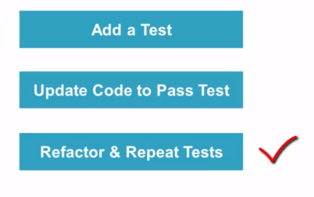

# THRILLIO BOOKMARKING APPLICATION
 ### INTRO

A Java based BookMarking application that allows user to store bookmarks of various types such as WebLinks, Books, Movies etc in a MySQL database. 
The project makes use of Java OOPs concept to improve readability and mimic the function of a production program.
It also follows the MVC or The Model View Controller application type to enable web support in the future.
The bookmarks are also backed up locally using the concept of multi-threading which makes sure the app interaction remains smooth while the local backup occurs behind the scenes.

### FEATURES
1. The Java app utilizes the modern MVC Architecture.
2. Latest Java design patterns are followed to ensure data consistency and safety.
3. Connected with Local MySQL server to store the bookmarks.
4. Utilizes Multi-threading to backup the bookmarked links locally, without affecting the app interaction.

### SKILLS LEARNED

1. MVC architecture - Understanding the MVC architecture, it importance and role in a project.
2. Design patterns - Aware about the Singleton pattern
3.  TDD or Test-Driven Development An approach where Test first and code later is followed.
 
